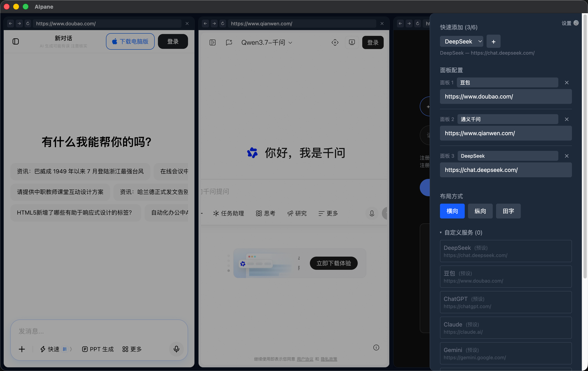
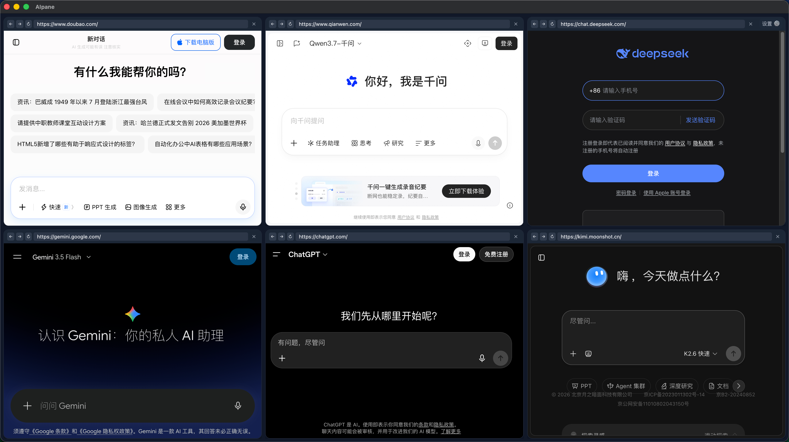

# AIpane

> 专为 AI 打造的多面板浏览器 —— 同时对比 DeepSeek、ChatGPT、Claude、Gemini 等多个 AI 的回答，一个窗口搞定。

<p align="center">
  
  
  
</p>

[English](README.md) | 中文

## 为什么用 AIpane？

和 AI 协作时，一个答案往往不够。AIpane 让你同时向多个 AI 服务提问，横向对比输出，选出最优解 —— 无需来回切换标签页。

## 功能

- **AI 回答并排对比** — 同时向 DeepSeek、ChatGPT、Claude、Gemini 等提问并对比结果
- **1–6 个独立面板** — 各自独立的 webview，互不干扰
- **三种布局** — 横向 / 纵向 / 田字，随时切换
- **拖拽分割线** — 自由调整面板比例
- **拖拽排序** — 拖地址栏交换面板位置
- **AI 服务配置管理** — 8 个内置预设（DeepSeek、ChatGPT、Claude 等） + 支持添加自己的服务（Ollama、自部署 LLM 等），可自由增删改，重启后持久保留
- **地址栏导航** — 完整 URL 导航，支持前进、后退、刷新
- **自动保存** — 布局、面板、URL 重启后自动恢复
- **快捷键** — `Ctrl+T` / `Cmd+T` 新建面板

## 截图

<p align="center">
  
  <br><em>并排对比多个 AI 的回答</em>
</p>

<p align="center">
  
  <br><em>管理自定义 AI 服务</em>
</p>

## 快速开始

**前置条件：** Node.js ≥ 18，pnpm ≥ 8

```bash
# 安装依赖
pnpm install

# 开发模式（含 HMR 热更新）
pnpm dev

# 生产模式（无 HMR，更接近打包后的效果）
node build.mjs && ./node_modules/.bin/electron .
```

### 开发 vs 生产模式

| | 开发模式 | 生产模式 |
|---|---|---|
| 渲染层 | Vite HMR，改动即时生效 | 构建产物，需重新构建 |
| 主进程 | 重启 Electron | 重新构建 + 重启 |
| 加载方式 | `http://localhost:5173` | `file://` |
| 适用场景 | 调 UI、调样式 | 调主进程、打包前验证 |

## 打包发布

构建各平台安装包：

```bash
# 清理 devDependencies（打包前必须）
rm -rf node_modules && pnpm install --prod --no-frozen-lockfile

# 构建所有平台（arm64 + x64）
npx electron-builder --mac --win --linux
npx electron-builder --win --linux --x64

# 恢复开发依赖
pnpm install
```

**注意：** 打包前必须 `install --prod`，否则 pnpm 下的 `electron-builder` 会把整个 `node_modules`（约 470M）打进安装包。

## 快捷键

| 快捷键 | 操作 |
|--------|------|
| `Ctrl+T` / `Cmd+T` | 新建面板 |

## 技术栈

Electron · React · TypeScript · zustand · Vite · Tailwind CSS

## 项目结构

```
src/
├── main/           # Electron 主进程（窗口管理、IPC）
├── preload/        # contextBridge 桥接层
├── renderer/       # React 应用
│   └── components/ # PanelGrid / PanelView / SplitPane / SettingsPanel
├── settings/       # 独立设置页面（备用）
└── shared/         # 跨进程类型定义
```
